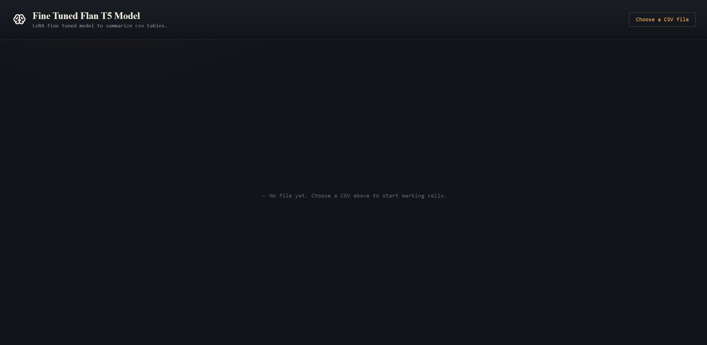
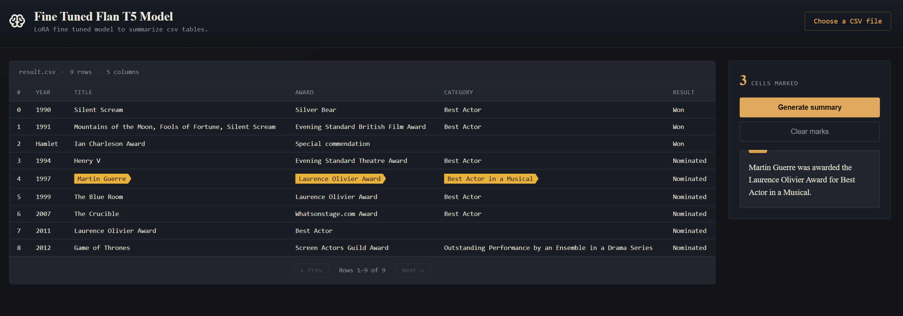
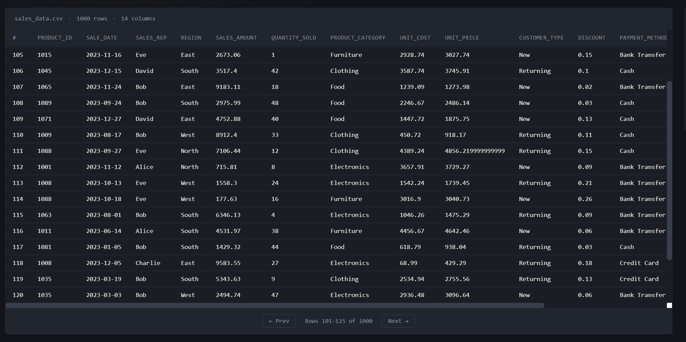

# FT-SLM: Table Summarization using a Fine-Tuned Small Language Model

> Interactive AI-powered table summarization using a **LoRA fine-tuned FLAN-T5** model trained for **Table-to-Text Generation**.


---

## Overview

This project was developed as part of an industrial internship focused on **fine-tuning Small Language Models (SLMs)** for **Table-to-Text Generation**.

The application enables users to:

- Upload CSV datasets
- Browse tabular data interactively
- Select one or more cells of interest
- Generate concise natural-language summaries using a **LoRA fine-tuned FLAN-T5** model

Unlike generic table summarization systems, the model is fine-tuned specifically for generating factual summaries from highlighted table regions while preserving contextual information.

---

## Repository Structure

```
FT_SLM/
│
├── FT_SLM_APP/          # React + TypeScript frontend
│
├── backend/             # Flask REST API + AI inference
│
└── README.md            # Project overview
```

---

## Architecture

```
                  +----------------------+
                  |   React Frontend     |
                  |  (TypeScript + Vite) |
                  +----------+-----------+
                             |
                      REST API Requests
                             |
                             ▼
                  +----------------------+
                  |     Flask Backend    |
                  |  Prompt Construction |
                  +----------+-----------+
                             |
                    FLAN-T5 + LoRA Adapter
                             |
                             ▼
                  Natural Language Summary
```

---

## Workflow

```
Upload CSV
      │
      ▼
CSV parsed into DataFrame
      │
      ▼
Interactive table viewer
      │
      ▼
User highlights cells
      │
      ▼
Prompt generation
      │
      ▼
Fine-tuned FLAN-T5
      │
      ▼
Generated Summary
```

---

# Project Components

## Frontend (`FT_SLM_APP`)

The frontend provides an intuitive interface for interacting with the AI model.

### Features

- CSV upload
- Interactive table visualization
- Cell highlighting
- Pagination
- Summary generation
- Error handling
- Responsive dark interface

### Technologies

- React
- TypeScript
- Vite
- Fetch API
- CSS

📖 **Documentation**

See:

```
FT_SLM_APP/README.md
```

---

## Backend (`backend`)

The backend exposes a REST API responsible for

- CSV processing
- Table storage
- Prompt construction
- Loading the fine-tuned model
- Running inference
- Returning generated summaries

### Technologies

- Flask
- Pandas
- PyTorch
- Transformers
- PEFT (LoRA)
- Hugging Face

📖 **Documentation**

See:

```
backend/README.md
```

---

# AI Model

**Base Model**

- Google FLAN-T5 Base

**Fine-Tuning**

- LoRA (Low-Rank Adaptation)

**Task**

- Table-to-Text Generation

**Dataset**

- ToTTo (Controlled Table-to-Text)

**Inference**

- Beam Search
- Deterministic decoding
- GPU acceleration (CUDA)

---

# Technologies Used

| Frontend | Backend | AI / ML |
|-----------|----------|----------|
| React | Flask | PyTorch |
| TypeScript | Pandas | Transformers |
| Vite | Flask-CORS | PEFT (LoRA) |
| CSS | REST API | FLAN-T5 |

---

# Screenshots

You can include screenshots of:

- Landing Interface

- CSV Uplaod

- Table Pagination


---

# Author

**Youssef Aitbouddroub**

Industrial Internship Project

**Topic**

> Fine-Tuning a Small Language Model for Table-to-Text Generation

---

# Documentation

| Module | Documentation |
|---------|---------------|
| Frontend | ["https://github.com/BigB021/FT_SLM_APP/blob/master/FT_SLM_APP/README.MD"](FT_SLM_APP/README.md) |
| Backend | ["https://github.com/BigB021/FT_SLM_APP/blob/master/backend/README.MD](backend/README.md) |

---

# License

This project was developed for academic and research purposes as part of an industrial internship.
